# 📡 Telco Customer Churn Prediction ML System

⭐ **If you find this project useful, consider giving it a star!**


Production-grade end-to-end machine learning system for **telecom customer churn prediction**
with a **3-tier intervention engine (RETAIN / OUTREACH / URGENT)**, probability calibration,
SHAP explainability, Champion vs Challenger system, revenue impact analysis,
and real-time API + monitoring dashboard.

---

## 🚀 Project Overview

This project builds a complete **Telecom-grade Churn Prediction System** that mirrors
how real telecom companies proactively retain customers at risk of leaving:

- Automated ML training pipeline (**13 models**, hyperparameter tuning)
- Rich feature engineering — **17 engineered features** (tenure cohorts, charge ratios, service adoption, contract stickiness signals)
- SMOTENC for class imbalance (handles mixed feature types — binary + continuous)
- Dual ColumnTransformer — scaled preprocessor for linear models, unscaled for tree models
- Probability calibration (holdout isotonic regression)
- **3-tier intervention engine** with hard + soft business rules
- **4-gate Champion vs Challenger** model promotion system (F1, ROC-AUC, Recall, Gap)
- Revenue impact evaluation — LTV loss, retention ROI
- SHAP explainability (TreeExplainer / KernelExplainer)
- MLflow experiment tracking
- PSI drift monitoring with visual dashboard
- Leakage detection before training
- **41 pytest unit tests** — 41/41 passing
- Real-time FastAPI + Customer Simulator (5 scenarios)
- Streamlit monitoring dashboard with Revenue Impact Panel
- Docker-ready (API + Dashboard)

---

## 💡 Why This Project Matters

Acquiring a new customer costs 5-7x more than retaining an existing one.
This system combines ML + business rules + revenue analysis to simulate
how real telecom companies prioritize retention spend on the customers
most likely to leave — before they actually do.

---

## 🌐 Live Demo

🚀 **Churn Prediction API (Live)**
👉 [https://telco-churn-prediction-mlops.onrender.com](https://telco-churn-prediction-mlops.onrender.com)

📊 **Monitoring Dashboard (Live)**
👉 [https://YOUR-STREAMLIT-LINK.streamlit.app](https://YOUR-STREAMLIT-LINK.streamlit.app)

📄 **API Docs (Swagger UI)**
👉 [https://telco-churn-prediction-mlops.onrender.com/docs](https://telco-churn-prediction-mlops.onrender.com/docs)

---

## 🏗 System Architecture

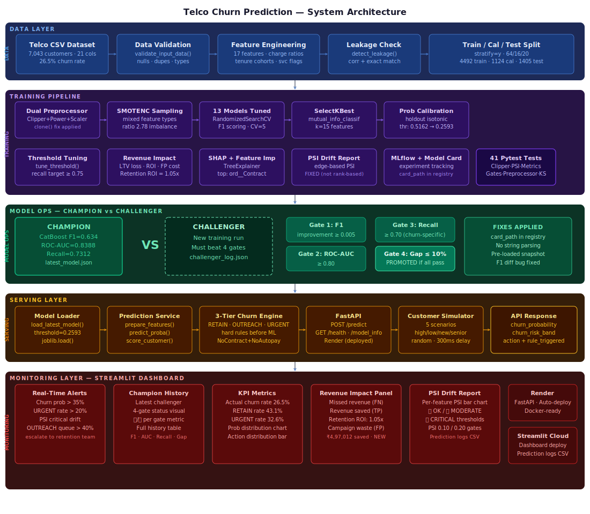

---

## 🎬 System Demo (End-to-End Flow)

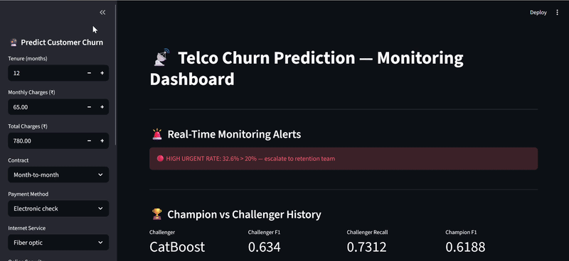

---

## 📈 Model Results

### Best Model — CatBoost (threshold = 0.2593)

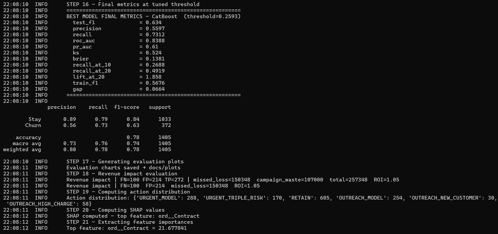

| Metric | Value |
|--------|-------|
| **Best Model** | **CatBoost** |
| F1 Score | 0.634 |
| ROC-AUC | 0.839 |
| Recall | 0.731 |
| Precision | 0.560 |
| PR-AUC | 0.61 |
| KS Statistic | 0.524 |
| Brier Score | 0.138 |
| Recall@10% | 0.269 |
| Recall@20% | 0.492 |
| Lift@20% | 1.858 |
| Revenue ROI | 1.05x |

> *Exact values depend on training run — see `churn_models/model_card_CatBoost_v1.json`*

### All 13 Models Comparison

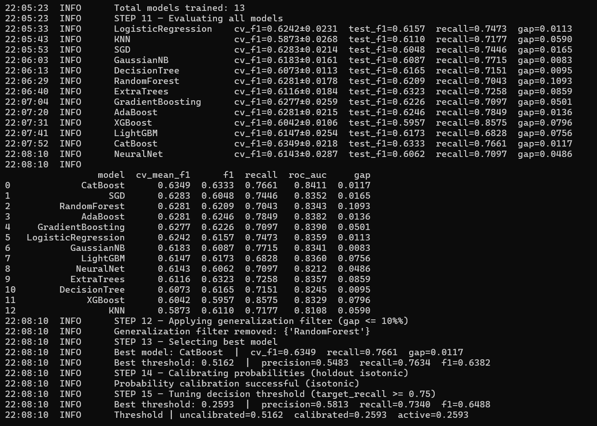

### Champion vs Challenger

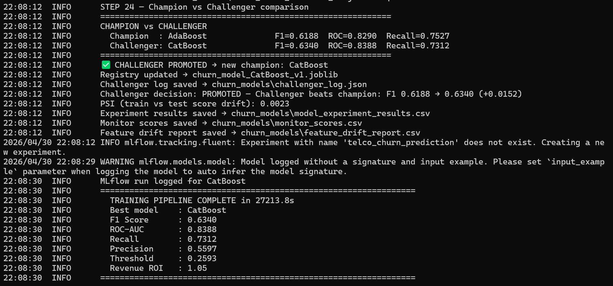

---

## 📈 Evaluation Plots

### Confusion Matrix

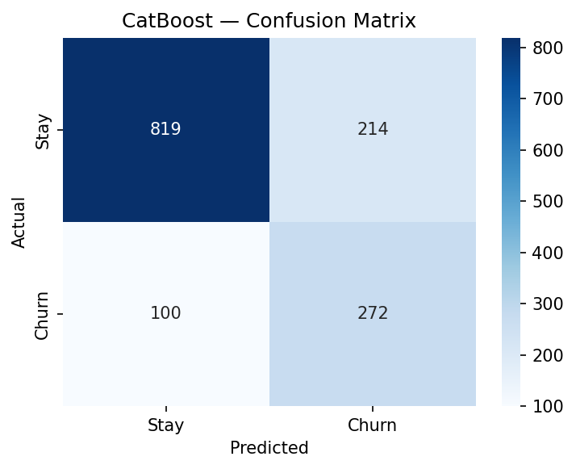

### ROC & Precision-Recall Curves

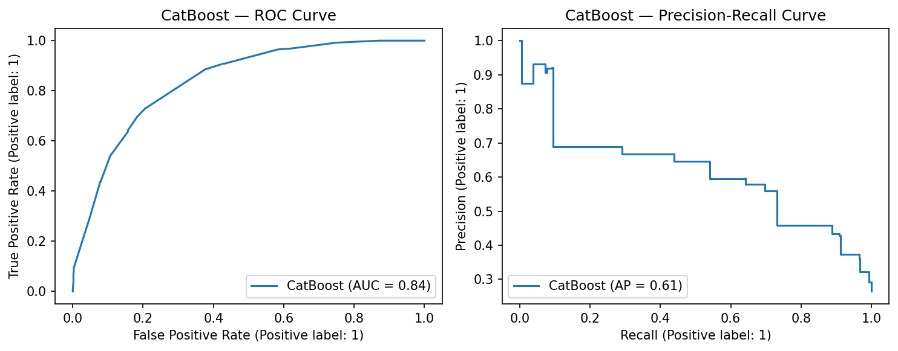

### SHAP Feature Importance (Top 15)

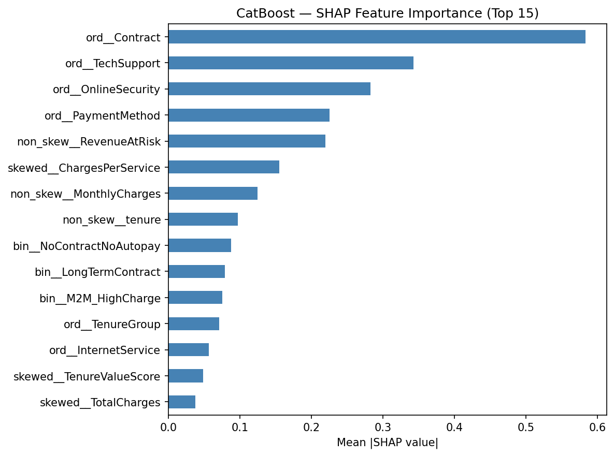

---

## 📊 Monitoring Dashboard

Real-time monitoring dashboard built with **Streamlit**.

### 🖥️ Full Dashboard UI

Real-time customer churn scoring + Champion vs Challenger + Revenue Impact Panel.

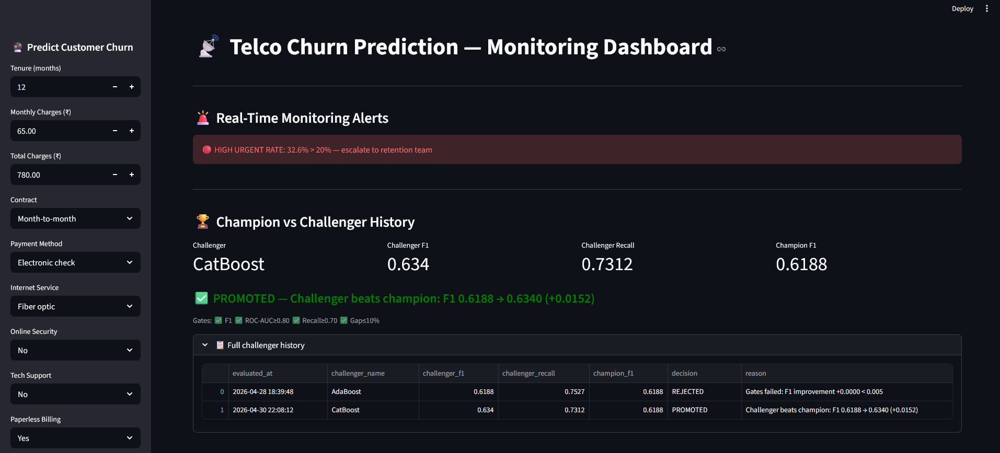

---

### 📈 Churn Probability + Action Distribution

Churn probability histogram with risk band thresholds and RETAIN/OUTREACH/URGENT breakdown.


---

### 💰 Churn Probability Statistics & Revenue Impact Panel

Estimated revenue at risk, revenue saved by model, retention ROI, and wasted campaign costs.

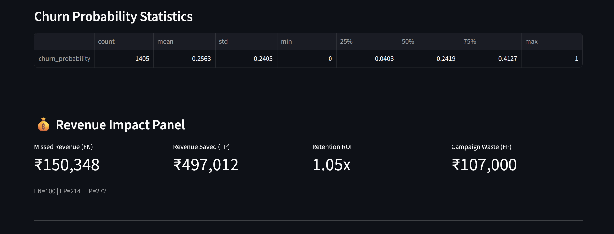

---

### PSI Drift Report

PSI drift monitoring with 🔴🟡🟢 status flags.

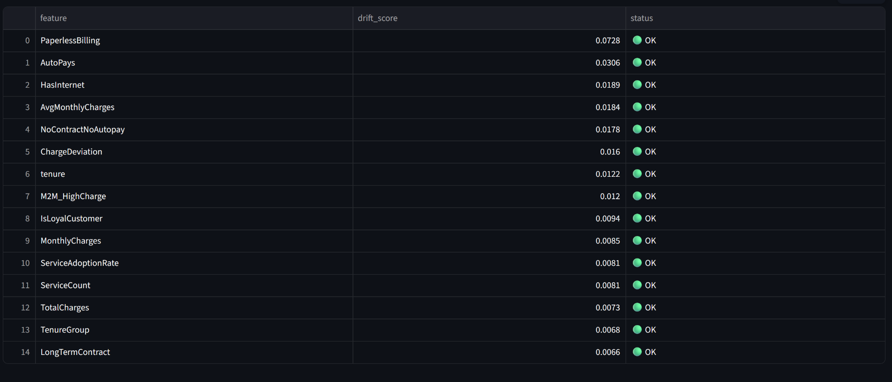

### Feature Drift — Top 15 Features

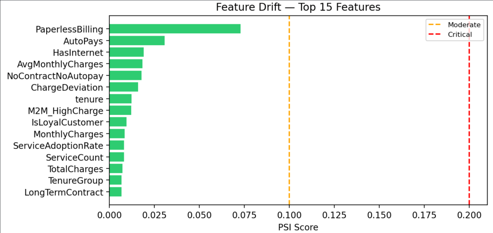

### Recent Predictions Log

Live prediction log.

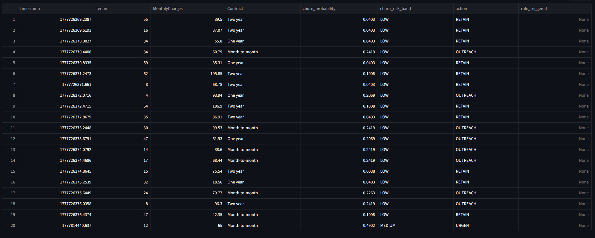

---

## 🧪 Test Coverage — 41/41 Passing


41 unit tests across 10 test classes:

| Class | Tests | What it covers |
|-------|-------|----------------|
| `TestConfig` | 6 | Gate constants, PSI thresholds, band coverage |
| `TestDataLoader` | 5 | Validation, null fill, feature engineering |
| `TestChurnEngine` | 7 | Risk bands, actions, edge cases |
| `TestMetrics` | 8 | Threshold tuning, PSI, KS, Recall@K, Lift@K |
| `TestLeakageCheck` | 3 | Clean data, injected leakage, return type |
| `TestDriftReport` | 2 | Numeric-only, non-negative scores |
| `TestScoreCustomer` | 2 | Output structure, low-prob retain |
| `TestClipper` | 3 | Shape, outlier removal, feature names |
| `TestPreprocessor` | 3 | 4-tuple return, independence (clone fix), cat indices |
| `TestKSStatistic` | 2 | Perfect separation, random model |

---

### 🔍 What This Dashboard Helps With

- Monitor churn probability distribution shifts over time
- Track RETAIN vs OUTREACH vs URGENT intervention rates
- Detect feature distribution drift (PSI) with visual bar chart
- Compare champion vs challenger model versions (4 gates — each shown as ✅/❌ metric block)
- Quantify revenue impact — LTV at risk vs revenue saved
- View real-time predictions with rule trigger details

---

## 🎯 3-Tier Intervention Engine

Unlike binary churn/no-churn models, this system uses a
**3-tier telecom intervention engine**:

| Action | Trigger |
|--------|---------|
| `RETAIN` | Low churn probability + no rule flags — standard engagement |
| `OUTREACH` | Medium risk OR soft rule (new customer / high charges without contract) |
| `URGENT` | High churn probability OR hard rule (new + no contract + no autopay) |

Rules are evaluated **before** ML score — matching real telecom retention workflows.

---

## 🏆 Champion vs Challenger System

### Champion vs Challenger


Every new training run is compared against the production champion using **4 promotion gates**:

| Gate | Condition | Rationale |
|------|-----------|-----------| 
| F1 Improvement | Challenger must beat champion by ≥ 0.5% | Meaningful improvement only |
| ROC-AUC | ≥ 0.80 | Minimum discrimination ability |
| **Recall** | **≥ 0.70** | **Churn-specific: must catch churners** |
| Generalization Gap | Train-test gap ≤ 10% | No overfitting |

> **Run 1:** AdaBoost promoted as first champion (F1=0.619)
> **Run 2:** CatBoost challenger promoted (F1=0.634, +0.015 improvement, all 4 gates passed)

> **Why a Recall gate?** A model with high AUC but low recall at threshold is useless for churn —
> it ranks customers well but fails to flag actual churners when deployed.
> The recall gate ensures the deployed model catches ≥ 70% of real churners.

Results logged to `churn_models/challenger_log.json` and visible in dashboard with per-gate ✅/❌ status.

---

## 💰 Revenue Impact Evaluation

Telecom-grade cost model (equivalent to Credit Risk ECL):

| Event | Cost Model |
|-------|-----------|
| Missed churner (FN) | Lost LTV = MonthlyCharges × 24 months |
| False alarm (FP) | Wasted campaign = ₹500 per customer |
| Caught churner (TP) | Revenue saved = MonthlyCharges × 24 months |

**Retention ROI** = (Revenue Saved − Campaign Cost) / Campaign Cost

**Result:** Missed Revenue ₹1,50,348 · Revenue Saved ₹4,97,012 · **Retention ROI = 1.05x**

---

## 📊 All 13 Models Evaluated

| Category | Models |
|----------|--------|
| Scaled (linear/distance) | LogisticRegression · KNN · SGD · GaussianNB |
| Unscaled (tree-based) | DecisionTree · RandomForest · ExtraTrees · GradientBoosting · AdaBoost · XGBoost · LightGBM · CatBoost |
| Separate | MLP NeuralNet |

---

## 📈 Evaluation Metrics Used

| Metric | Description |
|--------|-------------|
| F1 Score | Primary selection metric |
| ROC-AUC | Discrimination ability |
| PR-AUC | Precision-Recall balance |
| KS Statistic | Class separation |
| Brier Score | Probability calibration quality |
| **Recall@10%** | Churners caught in top-10% risk campaign |
| **Recall@20%** | Churners caught in top-20% risk campaign |
| **Lift@20%** | Campaign efficiency vs random targeting |
| Train-Test Gap | Overfitting check |

---

## ⚙️ Engineered Features (17 total)

| Feature | Business Signal |
|---------|----------------|
| `AvgMonthlyCharges` | Total / tenure — detects pricing changes |
| `ChargeDeviation` | Current vs avg — recent price hike signal |
| `RevenueAtRisk` | MonthlyCharges × remaining lifetime |
| `IsNewCustomer` | tenure ≤ 3 months — highest churn window |
| `IsLoyalCustomer` | tenure ≥ 24 months — stickiest segment |
| `TenureGroup` | Cohort bins: 0-3 / 3-12 / 12-24 / 24-48 / 48-72 mo |
| `ServiceCount` | Breadth of services — switching cost proxy |
| `ServiceAdoptionRate` | % of available services subscribed |
| `HasInternet` | Core stickiness driver |
| `LongTermContract` | 1yr/2yr contract flag — strong retention signal |
| `AutoPays` | Autopay reduces cancellation friction |
| `ChargesPerService` | Overpaying signal — churn risk |
| `TenureValueScore` | tenure × MonthlyCharges — LTV proxy |
| `M2M_HighCharge` | Month-to-month + above median charges |
| `NoContractNoAutopay` | Double friction-free — easiest to leave |
| `HighChargeFlag` | Above 75th percentile charges |
| `ZeroTotalCharges` | New customer with no billing history |

---

## 🐳 Docker

Run the full system locally with Docker Compose:

```bash
# Build and start API + Dashboard
docker-compose up --build

# API available at:  http://localhost:8000
# Dashboard at:      http://localhost:8501
# Swagger docs at:   http://localhost:8000/docs
```

Run services individually:

```bash
# API only
docker build -t churn-api .
docker run -p 8000:8000 -v $(pwd)/churn_models:/app/churn_models churn-api

# Dashboard only
docker build -f Dockerfile.dashboard -t churn-dashboard .
docker run -p 8501:8501 -v $(pwd)/churn_models:/app/churn_models churn-dashboard
```

> **Note:** Train the model locally first (`python scripts/train_model.py`) so `churn_models/` contains the trained artifacts before starting Docker.

---

## ⚙️ How to Run

### 1. Train Model

```bash
python scripts/train_model.py
```

### 2. Start API

```bash
python scripts/run_api.py
```

### 3. Run Customer Simulator

```bash
python scripts/run_simulation.py
```

### 4. Start Monitoring Dashboard

```bash
python scripts/run_dashboard.py
```

---

## 🧪 Run Tests

```bash
# Run all 41 tests
pytest tests/ -v

# With coverage report
pytest tests/ -v --cov=src --cov-report=term-missing
```

---

## ⚡ Real-Time Prediction API

### Endpoint

```
POST /predict
```

### Example Request

**POST** `/predict`

```json
{
  "tenure": 2,
  "MonthlyCharges": 85.5,
  "TotalCharges": 171.0,
  "Contract": "Month-to-month",
  "PaymentMethod": "Electronic check",
  "InternetService": "Fiber optic",
  "OnlineSecurity": "No",
  "TechSupport": "No",
  "PaperlessBilling": "Yes",
  "SeniorCitizen": 0,
  "gender": "Female",
  "Partner": "No",
  "Dependents": "No",
  "OnlineBackup": "No",
  "DeviceProtection": "No",
  "StreamingTV": "Yes",
  "StreamingMovies": "Yes",
  "PhoneService": "Yes",
  "MultipleLines": "No"
}
```

### Example Response

```json
{
  "churn_probability": 0.8231,
  "churn_risk_band": "HIGH",
  "action": "URGENT",
  "rule_triggered": "NEW_CUSTOMER_NO_CONTRACT_NO_AUTOPAY",
  "latency_seconds": 0.032
}
```

---

## 🔁 Customer Simulator

```bash
python scripts/run_simulation.py
```

Supports **5 scenarios**:

| Scenario | Profile |
|----------|---------|
| `random` | Mixed realistic customer profiles |
| `high_churn` | New customer + M2M + fiber + high charges |
| `low_churn` | Long tenure + 2yr contract + autopay + all services |
| `new_customer` | tenure=0, just signed up |
| `senior` | Senior citizen + fiber optic |

---

## 📂 Project Structure

```
telco-churn-prediction-mlops/
│
├── src/
│   ├── config.py              ← constants + gate thresholds + risk bands
│   ├── data_loader.py         ← validation + 17 feature engineering
│   ├── preprocessing.py       ← Clipper + dual ColumnTransformer (clone fix)
│   ├── model_tuning.py        ← 13 model grids + tune_models + MLP
│   ├── metrics.py             ← PSI, KS, revenue impact, recall@K, lift@K
│   ├── churn_engine.py        ← 3-tier intervention engine + business rules
│   ├── evaluation.py          ← eval pipeline, calibration, SHAP, model save
│   ├── leakage_check.py       ← pre-training leakage detection
│   ├── model_card.py          ← build + save structured model card JSON
│   ├── model_loader.py        ← champion load + 4-gate challenger comparison
│   └── training_pipeline.py   ← full 24-step orchestration
│
├── services/
│   └── prediction_service.py  ← feature prep + model inference wrapper
│
├── serving/
│   └── churn_api.py           ← FastAPI /predict /health /model_info
│
├── monitoring/
│   └── monitoring_dashboard.py← Streamlit real-time monitoring dashboard
│
├── simulation/
│   └── customer_simulator.py  ← 5-scenario customer simulator
│
├── scripts/
│   ├── train_model.py         ← entry point for training pipeline
│   ├── run_api.py             ← launch FastAPI server
│   ├── run_dashboard.py       ← launch Streamlit dashboard
│   └── run_simulation.py      ← run customer simulation
│
├── tests/
│   └── test_pipeline_core.py  ← 41 pytest unit tests (41/41 passing)
│
├── churn_models/
│   ├── churn_model_CatBoost_v1.joblib   ← trained champion model
│   ├── latest_model.json                ← current champion registry
│   ├── model_card_CatBoost_v1.json      ← structured model card
│   ├── challenger_log.json              ← champion vs challenger history
│   ├── model_experiment_results.csv     ← all 13 models comparison table
│   ├── monitor_scores.csv               ← test set scores for monitoring
│   └── feature_drift_report.csv         ← PSI drift scores per feature
│
├── docs/
│   ├── architecture/
│   │   └── telco_churn_architecture.svg     ← 5-layer system architecture
│   ├── gifs/
│   │   └── system_demo.gif                  ← end-to-end demo recording
│   ├── plots/
│   │   ├── confusion_matrix.png
│   │   ├── roc_pr_curves.png
│   │   └── shap_importance.png
│   ├── reports/
│   │   ├── best_model.png
│   │   ├── model_results.png
│   │   ├── challenger_evaluation.png
│   │   └── test_coverage.png
│   └── screenshots/
│       ├── dashboard_full_ui.png
│       ├── churn_probability_and__action_distribution.png
│       ├── churn_probability_stats_and_revenue_impact.png
│       ├── drift_report.png
│       ├── feature_drift.png
│       └── recent_predictionrecent_prediction.png
│
├── Dockerfile                 ← API Docker image (multi-stage)
├── Dockerfile.dashboard       ← Streamlit Docker image
├── docker-compose.yml         ← API + Dashboard together
├── .dockerignore
├── .github/
│   └── workflows/
│       └── ci.yml             ← GitHub Actions — pytest only
├── requirements.txt           ← full dependencies
├── requirements_api.txt       ← API-only (Render)
├── requirements_dashboard.txt ← dashboard-only (Streamlit Cloud)
├── runtime.txt                ← Python version for Render
├── render.yaml                ← Render deployment config
└── README.md
```

---

## 🛠 Tech Stack

Python · Scikit-Learn · XGBoost · LightGBM · CatBoost · imbalanced-learn ·
FastAPI · Uvicorn · Streamlit · SHAP · MLflow · Pytest · Pandas · NumPy · Seaborn ·
Docker · GitHub Actions · Render · Streamlit Cloud

---

## 👤 Author

**Narendra Kalam**

Machine Learning & Data Science | MSc Computer Science | Gold Medalist NASSCOM

📧 kalamnarendra2001@gmail.com

🔗 [linkedin.com/in/narendra-kalam](https://www.linkedin.com/in/narendra-kalam)