# 📡 Telco Customer Churn Prediction — ML System

[](https://github.com/narendrakalam2001/telco-churn-prediction-mlops/actions)
[](https://python.org)
[](https://fastapi.tiangolo.com)
[](https://streamlit.io)
[](#-champion-model-results)
[](https://docker.com)
[](https://mlflow.org)
[](#-test-coverage)

> **Domain:** Telecom / BFSI-adjacent Retention Analytics
> **Problem:** Binary Classification — Customer Churn Prediction
> **Dataset:** [Telco Customer Churn — 7,043 customers · 19 raw features → 17 engineered](https://www.kaggle.com/datasets/blastchar/telco-customer-churn)
> **Industry Context:** Simulates how telecom companies prioritize retention spend — 3-tier RETAIN / OUTREACH / URGENT intervention engine with revenue-impact scoring

---

## 💡 Why This Project Matters

Acquiring a new customer costs 5–7x more than retaining an existing one. This system combines
ML + business rules + revenue analysis to simulate how real telecom companies prioritize
retention spend on the customers most likely to leave — before they actually do:

- A **calibrated CatBoost classifier** (selected from 13 tuned models) predicts churn probability
  from 17 engineered features — tenure cohorts, charge ratios, service adoption, contract stickiness
- A **3-tier Intervention Engine** applies hard + soft business rules **before** the ML score —
  a brand-new customer with no contract and no autopay is flagged `URGENT` regardless of the raw
  probability, mirroring real telecom retention workflows
- Every model promotion goes through a **4-gate Champion vs Challenger** check (F1, ROC-AUC,
  **Recall**, generalization gap) — the recall gate specifically ensures the deployed model
  actually catches churners, not just ranks them well
- A **Revenue Impact Evaluation** translates model performance into ₹ terms — missed LTV vs
  campaign cost vs retention ROI — not just an abstract accuracy number

---

## 🏆 Champion Model Results

**Best Model — CatBoost** (calibrated threshold = `0.2593`)

| Metric | Value |
|---|---|
| **Champion Model** | `CatBoost` |
| **F1 Score** | `0.634` |
| **ROC-AUC** | `0.8388` |
| **PR-AUC** | `0.61` |
| **Recall** | `0.7312` |
| **Precision** | `0.5597` |
| **KS Statistic** | `0.524` |
| **Brier Score** | `0.1381` |
| **Recall@10%** | `0.2688` |
| **Recall@20%** | `0.4919` |
| **Lift@20%** | `1.858` |
| **Train F1 / Gap** | `0.5676` / `0.0664` |
| **Retention ROI** | `1.05x` |

**Classification report (test set, n=1,405):**

| Class | Precision | Recall | F1 | Support |
|---|---|---|---|---|
| Stay | 0.89 | 0.79 | 0.84 | 1,033 |
| Churn | 0.56 | 0.73 | 0.63 | 372 |
| **Accuracy** | | | **0.78** | 1,405 |

> *Exact values depend on training run — see `churn_models/model_card_CatBoost_v1.json`*

---

## 🔗 Live Links

| Service | URL |
|---|---|
| 🚀 **API Docs (Swagger UI)** | [telco-churn-prediction-mlops.onrender.com/docs](https://telco-churn-prediction-mlops.onrender.com/docs) |
| 📊 **Monitoring Dashboard** | [telco-churn-prediction-mlops.streamlit.app](https://telco-churn-prediction-mlops.streamlit.app) |
| 📓 **EDA Notebook** | [notebooks/telco_churn_eda.ipynb](notebooks/telco_churn_eda.ipynb) |

> ⚠️ Render free tier: first request may take 30–60 seconds (cold start).

---

## 🏗️ System Architecture

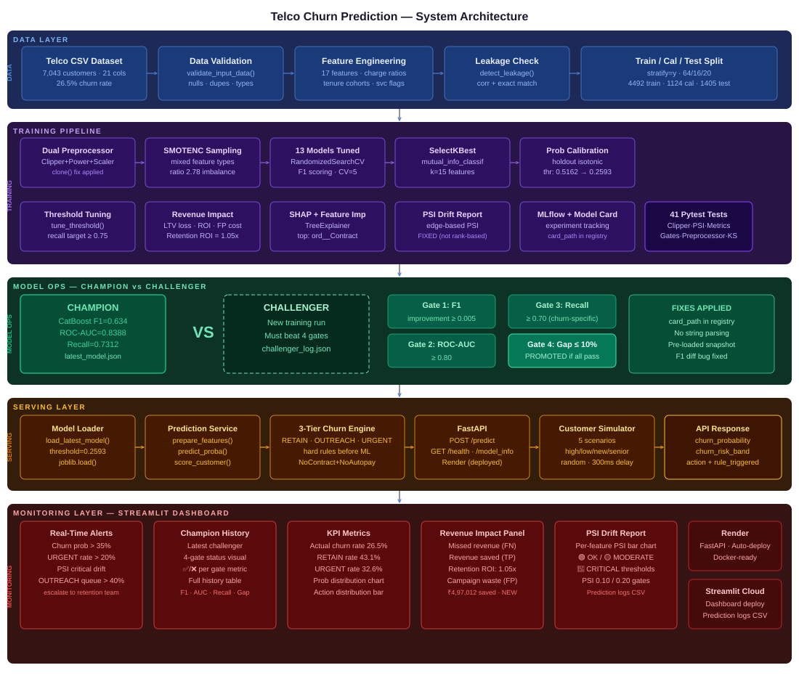

```
╔══════════════════════════════════════════════════════════════════════════════════╗
║             TELCO CHURN PREDICTION — 5-LAYER PRODUCTION SYSTEM                   ║
╠══════════════════════════════════════════════════════════════════════════════════╣
║                                                                                  ║
║  ┌─────────────────────────────── DATA LAYER ──────────────────────────────┐     ║
║  │  Customer CSV  →  Validate + Null Fill  →  17 Feature Engineering       │     ║
║  │  7,043 customers · tenure cohorts · charge ratios · service adoption    │     ║
║  └───────────────────────────────────┬─────────────────────────────────────┘     ║
║                                      ▼                                           ║
║  ┌─────────────────────────── TRAINING PIPELINE ───────────────────────────┐     ║
║  │                                                                         │     ║
║  │  ┌──────────────────┐    ┌───────────────┐    ┌──────────────────────┐  │     ║
║  │  │  Dual Column     │    │  13 Models    │    │  Evaluation          │  │     ║
║  │  │  Transformer +   │───▶│  Tuned +      │───▶│  F1 · ROC-AUC · KS  │  │     ║
║  │  │  SMOTENC balance │    │  Calibrated   │    │  Recall@K · Lift@K   │  │     ║
║  │  └──────────────────┘    └───────────────┘    └──────────────────────┘  │     ║
║  │                                                                         │     ║
║  │  LR · KNN · SGD · GaussianNB · DecisionTree · RandomForest · ExtraTrees │     ║
║  │  GradientBoosting · AdaBoost · XGBoost · LightGBM · CatBoost ⭐ · MLP   │     ║
║  │                                                                         │     ║
║  │  Generalization filter (gap ≤ 10%) removes RandomForest (gap=0.1093)    │     ║
║  │  CHAMPION → CatBoost  cv_f1=0.6349  recall=0.7661  gap=0.0117           │     ║
║  └───────────────────────────────────┬─────────────────────────────────────┘     ║
║                                      ▼                                           ║
║  ┌──────────────────────── CHAMPION-CHALLENGER ────────────────────────────┐     ║
║  │                                                                         │     ║
║  │  Gate 1: F1 improvement    ≥ 0.5%   →  ✅ PASS / ❌ FAIL               │     ║
║  │  Gate 2: ROC-AUC           ≥ 0.80   →  ✅ PASS / ❌ FAIL               │     ║
║  │  Gate 3: Recall            ≥ 0.70   →  ✅ PASS / ❌ FAIL               │     ║
║  │  Gate 4: Train-test gap    ≤ 10%    →  ✅ PASS / ❌ FAIL               │     ║
║  │                                                                         │     ║
║  │  ALL gates pass → PROMOTED (latest_model.json updated)                  │     ║
║  │  ANY gate fails → REJECTED (champion retained, result logged)           │     ║
║  └───────────────────────────────────┬─────────────────────────────────────┘     ║
║                                      ▼                                           ║
║  ┌──────────────────────────── SERVING LAYER ──────────────────────────────┐     ║
║  │                                                                         │     ║
║  │  Model Loader  →  Prediction Service  →  Churn Engine  →  FastAPI       │     ║
║  │                                                                         │     ║
║  │  POST /predict → single customer scoring    (→ RETAIN/OUTREACH/URGENT)  │     ║
║  │  GET  /health  → API health check            (→ {status, model_loaded}) │     ║
║  │  GET  /model_info → champion model card       (→ metrics + revenue ROI) │     ║
║  │                                                                         │     ║
║  │  Churn Engine:  Hard/Soft Rules → ML Score → Risk Band                  │     ║
║  │                 → RETAIN / OUTREACH / URGENT                            │     ║
║  └───────────────────────────────────┬─────────────────────────────────────┘     ║
║                                      ▼                                           ║
║  ┌─────────────────── MONITORING LAYER — STREAMLIT DASHBOARD ──────────────┐     ║
║  │                                                                         │     ║
║  │  Section 1: Churn Prob + Action Distribution → RETAIN/OUTREACH/URGENT   │     ║
║  │  Section 2: Revenue Impact Panel  → LTV at risk · revenue saved · ROI   │     ║
║  │  Section 3: Champion-Challenger   → 4-gate ✅/❌ status · history      │     ║
║  │  Section 4: PSI Drift             → top-15 features, 🔴🟡🟢 flags      │     ║
║  │  Section 5: Recent Predictions    → churn band · action · rule fired    │     ║
║  │                                                                         │     ║
║  │  Simulator: 5 scenarios (random · high_churn · low_churn · new · senior)│     ║
║  └─────────────────────────────────────────────────────────────────────────┘     ║
╚══════════════════════════════════════════════════════════════════════════════════╝
```

---

## 📸 Dashboard Screenshots

### 🖥️ Full Dashboard UI

Real-time customer churn scoring + Champion vs Challenger + Revenue Impact Panel.

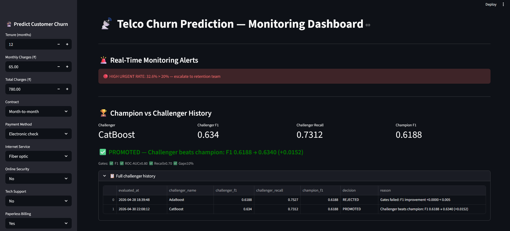

---

### 📈 Churn Probability + Action Distribution

Churn probability histogram with risk-band thresholds and RETAIN / OUTREACH / URGENT breakdown.

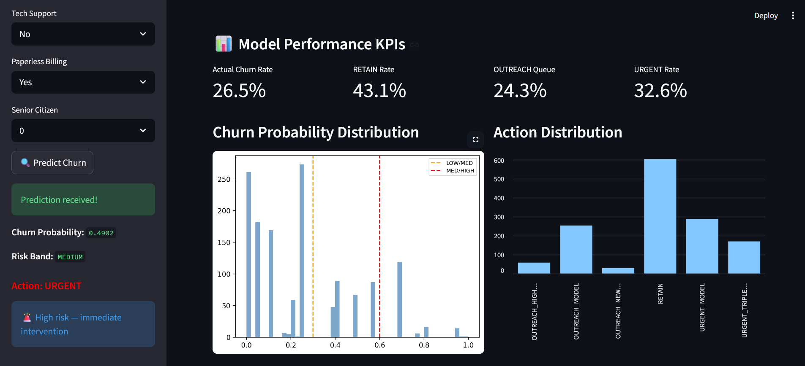

---

### 💰 Churn Probability Statistics & Revenue Impact Panel

Estimated revenue at risk, revenue saved by the model, retention ROI, and wasted campaign costs.

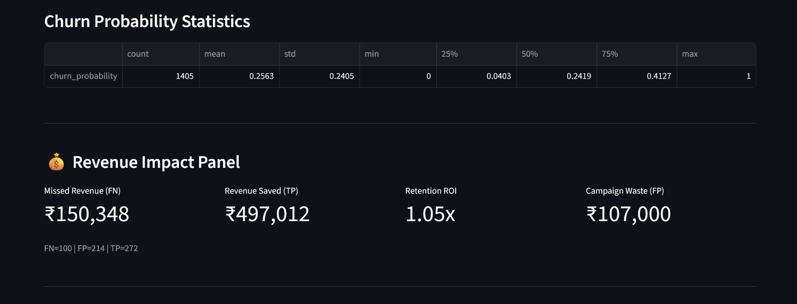

---

### 📉 PSI Drift Report

PSI drift monitoring (top 15 features) with 🔴🟡🟢 status flags.

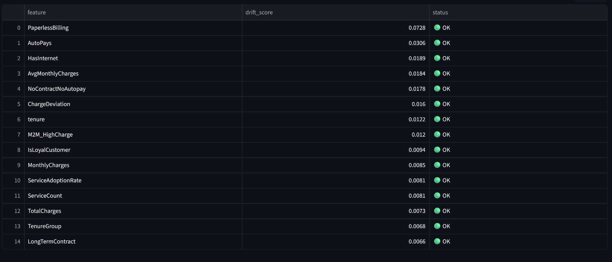
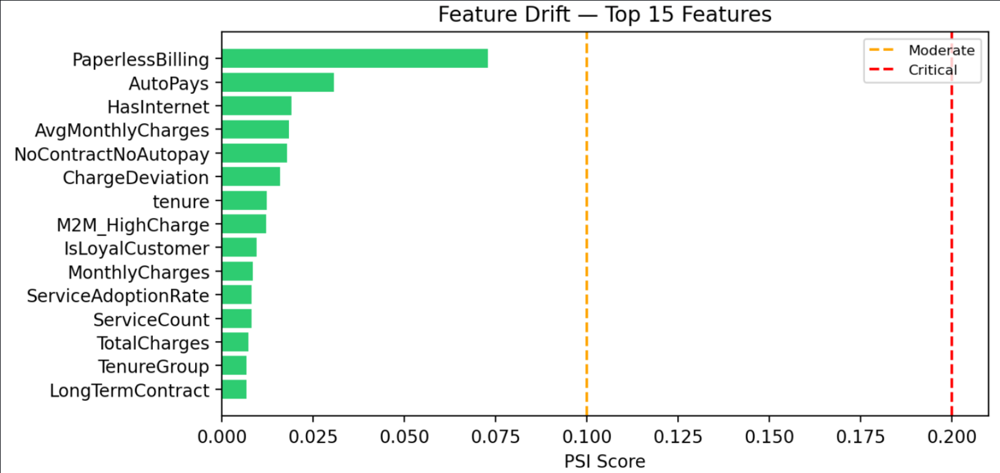

---

### 🔍 Recent Predictions Log

Live prediction log — churn band, action, rule triggered per customer.


---

## 📊 Training Reports

| Best Model Metrics | All 13 Models Comparison |
|---|---|
| 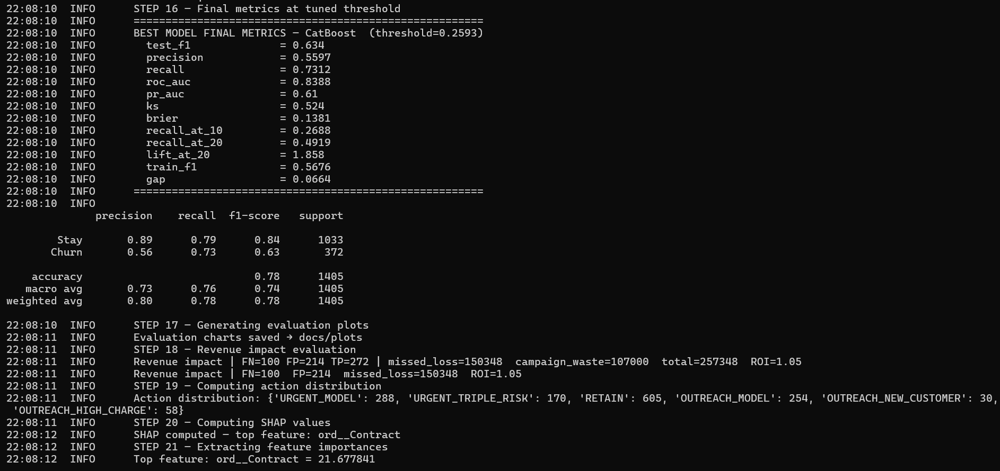 | 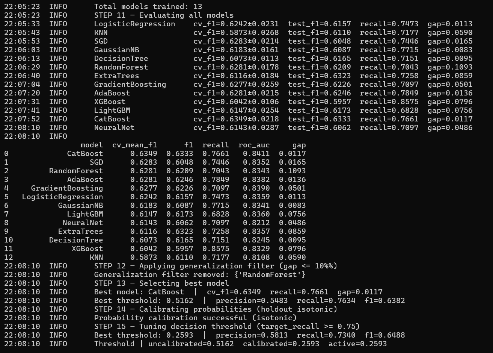 |

| Champion vs Challenger | Test Coverage |
|---|---|
| 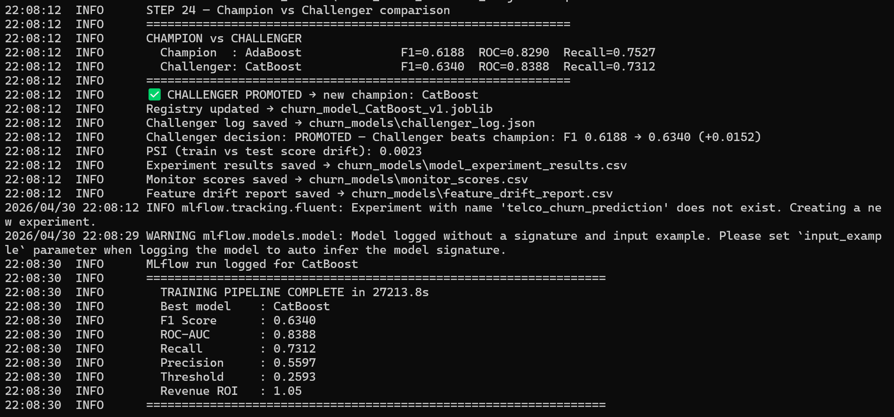 | 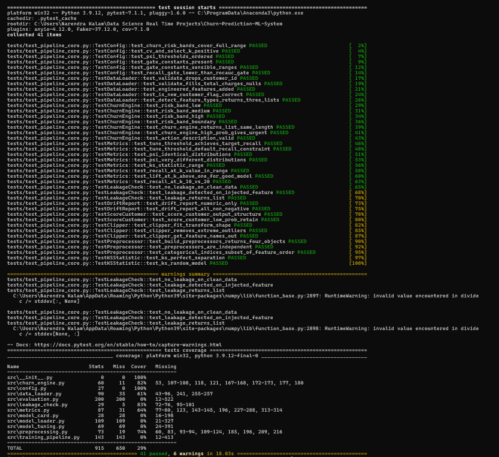 |

| Confusion Matrix | ROC & PR Curves |
|---|---|
| 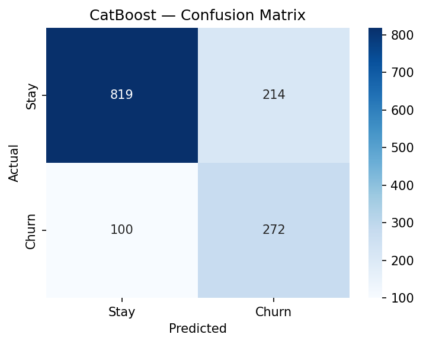 | 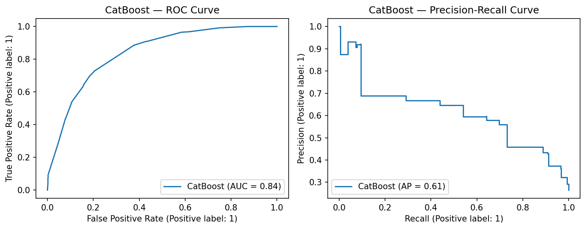 |

| SHAP Feature Importance (Top 15) |
|---|
| 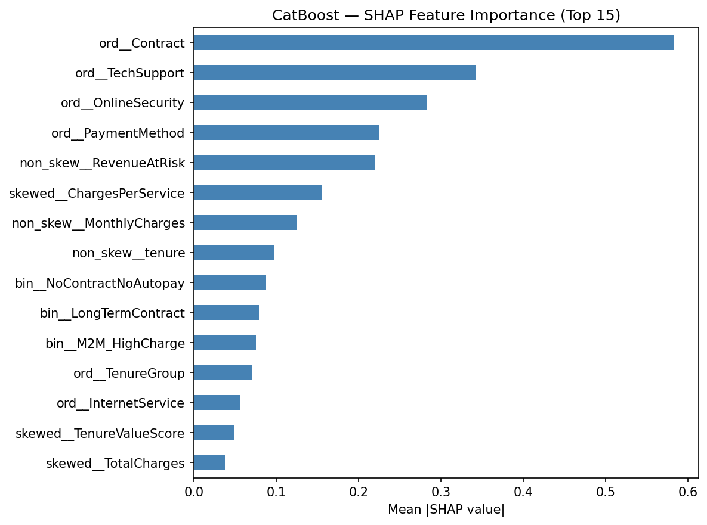 |

---

## 🎬 System Demo

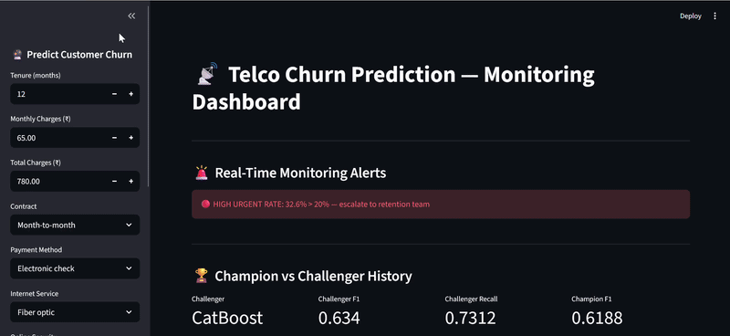

---

## 📁 Project Structure

```
telco-churn-prediction-mlops/
│
├── src/                                 # Core ML system
│   ├── config.py                        # Constants + gate thresholds + risk bands
│   ├── data_loader.py                   # Validation + 17-feature engineering
│   ├── preprocessing.py                 # Clipper + dual ColumnTransformer (clone fix)
│   ├── model_tuning.py                  # 13 model grids + tune_models (incl. MLP)
│   ├── metrics.py                       # PSI, KS, revenue impact, Recall@K, Lift@K
│   ├── churn_engine.py                  # 3-tier intervention engine + business rules
│   ├── evaluation.py                    # Eval pipeline, calibration, SHAP, model save
│   ├── leakage_check.py                 # Pre-training leakage detection
│   ├── model_card.py                    # Structured model card (JSON)
│   ├── model_loader.py                  # Champion load + 4-gate challenger comparison
│   └── training_pipeline.py             # Full 24-step orchestration
│
├── services/
│   └── prediction_service.py            # Feature prep + model inference wrapper
│
├── serving/
│   └── churn_api.py                     # FastAPI: /predict · /health · /model_info
│
├── monitoring/
│   └── monitoring_dashboard.py          # Streamlit real-time monitoring dashboard
│
├── simulation/
│   └── customer_simulator.py            # 5-scenario customer simulator
│
├── scripts/
│   ├── train_model.py                   # Entry point for training pipeline
│   ├── run_api.py                       # Launch FastAPI server
│   ├── run_dashboard.py                 # Launch Streamlit dashboard
│   └── run_simulation.py                # Run customer simulation
│
├── tests/
│   └── test_pipeline_core.py            # 41 pytest unit tests (41/41 passing)
│
├── notebooks/
│   └── telco_churn_eda.ipynb            # Professional EDA — 22 steps · 46 cells
│
├── data/
│   └── sample_telco_churn_balanced.csv  # A representative balanced sample dataset is provided in quick testing
│
├── churn_models/                        # Model artifacts — all files pushed to GitHub
│   ├── churn_model_CatBoost_v1.joblib   # Trained champion model
│   ├── latest_model.json                # Current champion registry
│   ├── model_card_CatBoost_v1.json      # Structured model card
│   ├── challenger_log.json              # Champion vs Challenger history
│   ├── model_experiment_results.csv     # All 13 models comparison table
│   ├── monitor_scores.csv               # Test set scores for monitoring
│   └── feature_drift_report.csv         # PSI drift scores per feature
│
├── docs/
│   ├── architecture/
│   │   └── telco_churn_architecture.svg # 5-layer system architecture
│   ├── gifs/
│   │   └── system_demo.gif              # End-to-end demo recording
│   ├── plots/
│   │   ├── confusion_matrix.png
│   │   ├── roc_pr_curves.png
│   │   └── shap_importance.png
│   ├── reports/
│   │   ├── best_model.png
│   │   ├── model_results.png
│   │   ├── challenger_evaluation.png
│   │   └── test_coverage.png
│   └── screenshots/
│       ├── dashboard_full_ui.png
│       ├── churn_probability_and_action_distribution.png
│       ├── churn_probability_stats_and_revenue_impact.png
│       ├── drift_report.png
│       ├── feature_drift.png
│       └── recent_prediction.png
│
├── logs/
│   └── prediction_logs.csv              # API prediction audit log (auto-generated)
│
├── Dockerfile                           # API Docker image (multi-stage)
├── Dockerfile.dashboard                 # Streamlit Docker image
├── docker-compose.yml                   # API + Dashboard together
├── .dockerignore
├── .github/workflows/ci.yml             # GitHub Actions — pytest on every push
├── .gitignore
├── LICENSE                              # MIT License
├── README.md                            # This file
├── requirements.txt                     # Full dependencies
├── requirements_api.txt                 # API-only (Render)
├── requirements_dashboard.txt           # Dashboard-only (Streamlit Cloud)
├── runtime.txt                          # Python version for Render
└── render.yaml                          # Render deployment config
```

---

## 🚀 Quickstart

### 1. Clone & Install

```bash
git clone https://github.com/narendrakalam2001/telco-churn-prediction-mlops.git
cd telco-churn-prediction-mlops
pip install -r requirements.txt
```

### 2. Download Dataset

Download [Kaggle — Telco Customer Churn](https://www.kaggle.com/datasets/blastchar/telco-customer-churn) 
```
data/
└── sample_telco_churn_balanced.csv

# A representative balanced sample dataset is provided in quick testing
```

### 3. Train Model

```bash
python scripts/train_model.py
```

Expected output:
```
INFO  Total models trained: 13
INFO  Generalization filter (gap ≤ 10%) removed: {'RandomForest'}
INFO  Best model: CatBoost  |  cv_f1=0.6349  recall=0.7661  gap=0.0117
INFO  Probability calibration successful (isotonic)
INFO  Best threshold: 0.2593  |  precision=0.5813  recall=0.7340  f1=0.6488
INFO  CHAMPION vs CHALLENGER
      Champion  : AdaBoost   F1=0.6188  ROC=0.8290  Recall=0.7527
      Challenger: CatBoost   F1=0.6340  ROC=0.8388  Recall=0.7312
✅ CHALLENGER PROMOTED → new champion: CatBoost
INFO  TRAINING PIPELINE COMPLETE  |  Best model: CatBoost  |  F1=0.6340
```

### 4. Start API

```bash
python scripts/run_api.py
# → http://localhost:8000/docs
```

### 5. Start Monitoring Dashboard

```bash
python scripts/run_dashboard.py
# → http://localhost:8501
```

### 6. Run Customer Simulator

```bash
python scripts/run_simulation.py
```

### 7. Run Tests

```bash
pytest tests/ -v --cov=src --cov-report=term-missing
# 41 collected · 41 passed
```

---

## 🐳 Docker

```bash
# Build and start API + Dashboard
docker-compose up --build

# API only
docker build -t churn-api .
docker run -p 8000:8000 -v $(pwd)/churn_models:/app/churn_models churn-api

# Dashboard only
docker build -f Dockerfile.dashboard -t churn-dashboard .
docker run -p 8501:8501 -v $(pwd)/churn_models:/app/churn_models churn-dashboard
```

| Service | URL |
|---|---|
| FastAPI + Swagger | `http://localhost:8000/docs` |
| Streamlit Dashboard | `http://localhost:8501` |

> **Note:** Train the model locally first (`python scripts/train_model.py`) so `churn_models/` contains the trained artifacts before starting Docker.

---

## 🔌 API Reference

### POST /predict — Single Customer Churn Scoring

```bash
curl -X POST "http://localhost:8000/predict" \
  -H "Content-Type: application/json" \
  -d '{
    "tenure": 2,
    "MonthlyCharges": 85.5,
    "TotalCharges": 171.0,
    "Contract": "Month-to-month",
    "PaymentMethod": "Electronic check",
    "InternetService": "Fiber optic",
    "OnlineSecurity": "No",
    "TechSupport": "No",
    "PaperlessBilling": "Yes",
    "SeniorCitizen": 0,
    "gender": "Female",
    "Partner": "No",
    "Dependents": "No",
    "OnlineBackup": "No",
    "DeviceProtection": "No",
    "StreamingTV": "Yes",
    "StreamingMovies": "Yes",
    "PhoneService": "Yes",
    "MultipleLines": "No"
  }'
```

**Response:**
```json
{
  "churn_probability": 0.8231,
  "churn_risk_band": "HIGH",
  "action": "URGENT",
  "rule_triggered": "NEW_CUSTOMER_NO_CONTRACT_NO_AUTOPAY",
  "latency_seconds": 0.032
}
```

### GET /health

```json
{"status": "running", "model_loaded": true}
```

### GET /model_info

```json
{
  "model_name": "churn_model_CatBoost_v1.joblib",
  "metrics": {
    "f1_score": 0.634,
    "roc_auc": 0.8388,
    "recall": 0.7312,
    "precision": 0.5597,
    "ks_statistic": 0.524
  },
  "revenue_impact": {
    "retention_roi": 1.05
  }
}
```

---

## 🧠 Technical Standards

| Component | Implementation |
|---|---|
| **Class Imbalance** | SMOTENC — handles mixed feature types (binary + continuous) |
| **Dual Preprocessors** | `preprocessor_scaled` (linear models) + `preprocessor_unscaled` (tree models) |
| **Engineered Features** | 17 features — tenure cohorts, charge ratios, service adoption, contract stickiness |
| **Models Tuned** | LR · KNN · SGD · GaussianNB · DecisionTree · RandomForest · ExtraTrees · GradientBoosting · AdaBoost · XGBoost · LightGBM · **CatBoost** · MLP |
| **Generalization Filter** | Candidates with train-test gap > 10% dropped before selection |
| **Probability Calibration** | Holdout isotonic regression — threshold `0.5162` → calibrated `0.2593` |
| **Champion-Challenger** | 4-gate: F1 ≥ +0.5% · ROC-AUC ≥ 0.80 · **Recall ≥ 0.70** · Train-test gap ≤ 10% |
| **Explainability** | SHAP `TreeExplainer` — top feature: `ord__Contract` (importance = 21.68) |
| **Experiment Tracking** | MLflow — metrics · params · model artifact per run |
| **Model Card** | Structured JSON — metrics + revenue impact |
| **Leakage Detection** | Exact match · zero-variance skip · correlation guard |
| **Churn Engine** | Hard + soft business rules → RETAIN / OUTREACH / URGENT |
| **CI/CD** | GitHub Actions — pytest on every push |
| **Deployment** | Render.com (FastAPI) + Streamlit Cloud (Dashboard) |

---

## 📊 All 13 Models — Comparison Table

Full evaluation run (`cv_mean_f1` from 5-fold CV, `f1`/`recall`/`roc_auc` on holdout test set):

| Model | CV F1 (mean) | Test F1 | Recall | ROC-AUC | Gen. Gap |
|---|---|---|---|---|---|
| **CatBoost** ⭐ | **0.6349** | 0.6333 | 0.7661 | 0.8411 | 0.0117 |
| SGD | 0.6283 | 0.6048 | 0.7446 | 0.8352 | 0.0165 |
| RandomForest | 0.6281 | 0.6209 | 0.7043 | 0.8343 | **0.1093** ⚠️ |
| AdaBoost | 0.6281 | 0.6246 | 0.7849 | 0.8382 | 0.0136 |
| GradientBoosting | 0.6277 | 0.6226 | 0.7097 | 0.8390 | 0.0501 |
| LogisticRegression | 0.6242 | 0.6157 | 0.7473 | 0.8359 | 0.0113 |
| GaussianNB | 0.6183 | 0.6087 | 0.7715 | 0.8341 | 0.0083 |
| LightGBM | 0.6147 | 0.6173 | 0.6828 | 0.8360 | 0.0756 |
| NeuralNet (MLP) | 0.6143 | 0.6062 | 0.7097 | 0.8212 | 0.0486 |
| ExtraTrees | 0.6116 | 0.6323 | 0.7258 | 0.8357 | 0.0859 |
| DecisionTree | 0.6073 | 0.6165 | 0.7151 | 0.8245 | 0.0095 |
| XGBoost | 0.6042 | 0.5957 | 0.8575 | 0.8329 | 0.0796 |
| KNN | 0.5873 | 0.6110 | 0.7177 | 0.8108 | 0.0590 |

> ⚠️ **RandomForest was removed** by the generalization filter (`gap ≤ 10%` rule — its 0.1093 gap
> exceeded the cutoff), even though its raw CV F1 ranked competitively. **CatBoost** was then
> selected as the highest-F1 candidate that passed the filter.
>
> Full comparison generated at training time in `churn_models/model_experiment_results.csv`
> and visualised in `docs/reports/model_results.png`.

---

## 💰 Revenue Impact Evaluation

Telecom-grade cost model (equivalent to Credit Risk ECL):

| Event | Cost Model |
|---|---|
| Missed churner (FN) | Lost LTV = MonthlyCharges × 24 months |
| False alarm (FP) | Wasted campaign = ₹500 per customer |
| Caught churner (TP) | Revenue saved = MonthlyCharges × 24 months |

**Actual evaluation run** (test set, `FN=100 · FP=214 · TP=272`):

| Metric | Value |
|---|---|
| Missed Revenue (FN loss) | `₹1,50,348` |
| Campaign Waste (FP cost) | `₹1,07,000` |
| Total Estimated Cost | `₹2,57,348` |
| **Retention ROI** | **`1.05x`** |

**Retention ROI** = (Revenue Saved − Campaign Cost) / Campaign Cost

---

## 🎯 3-Tier Intervention Engine

Unlike binary churn/no-churn models, this system uses a **3-tier telecom intervention engine**:

| Action | Trigger |
|---|---|
| `RETAIN` | Low churn probability + no rule flags — standard engagement |
| `OUTREACH` | Medium risk OR soft rule (new customer / high charges without contract) |
| `URGENT` | High churn probability OR hard rule (new + no contract + no autopay) |

Rules are evaluated **before** the ML score — matching real telecom retention workflows.

**Real run — action distribution** (test set, `n=1,405`):

| Action | Count |
|---|---|
| `RETAIN` | `605` |
| `OUTREACH_MODEL` | `254` |
| `URGENT_MODEL` | `288` |
| `URGENT_TRIPLE_RISK` | `170` |
| `OUTREACH_HIGH_CHARGE` | `58` |
| `OUTREACH_NEW_CUSTOMER` | `30` |

---

## 🏆 Champion vs Challenger System

Every new training run is compared against the production champion using **4 promotion gates**:

| Gate | Condition | Rationale |
|---|---|---|
| F1 Improvement | Challenger must beat champion by ≥ 0.5% | Meaningful improvement only |
| ROC-AUC | ≥ 0.80 | Minimum discrimination ability |
| **Recall** | **≥ 0.70** | **Churn-specific: must catch churners** |
| Generalization Gap | Train-test gap ≤ 10% | No overfitting |

**Real run example:**

```
CHAMPION vs CHALLENGER
  Champion  : AdaBoost    F1=0.6188  ROC=0.8290  Recall=0.7527
  Challenger: CatBoost    F1=0.6340  ROC=0.8388  Recall=0.7312
✅ CHALLENGER PROMOTED → new champion: CatBoost
   Challenger decision: PROMOTED — Challenger beats champion: F1 0.6188 → 0.6340 (+0.0152)
   PSI (train vs test score drift): 0.0023
```

> **Why a Recall gate?** A model with high AUC but low recall at threshold is useless for churn —
> it ranks customers well but fails to flag actual churners when deployed. The recall gate ensures
> the deployed model catches at least 70% of real churners.

Results logged to `churn_models/challenger_log.json` and visible in the dashboard with per-gate ✅/❌ status.

---

## 📈 Monitoring Dashboard — 5 Sections

| Section | What it shows |
|---|---|
| **1. Churn Prob + Action Distribution** | Probability histogram · risk bands · RETAIN/OUTREACH/URGENT rates |
| **2. Revenue Impact Panel** | LTV at risk · revenue saved · retention ROI · wasted campaign cost |
| **3. Champion-Challenger** | 4-gate ✅/❌ status per metric block · full history |
| **4. PSI Drift** | Top-15 feature drift with 🔴🟡🟢 status flags |
| **5. Recent Predictions** | Churn band · action · rule triggered per customer |

---

## 🧪 Test Coverage — 41/41 Passing

```
41 tests collected across 10 test classes:

  TestConfig            (6)  — gate constants · PSI thresholds · band coverage
  TestDataLoader         (5)  — validation · null fill · feature engineering
  TestChurnEngine        (7)  — risk bands · actions · edge cases
  TestMetrics            (8)  — threshold tuning · PSI · KS · Recall@K · Lift@K
  TestLeakageCheck       (3)  — clean data · injected leakage · return type
  TestDriftReport        (2)  — numeric-only · non-negative scores
  TestScoreCustomer      (2)  — output structure · low-prob retain
  TestClipper            (3)  — shape · outlier removal · feature names
  TestPreprocessor       (3)  — 4-tuple return · independence (clone fix) · cat indices
  TestKSStatistic        (2)  — perfect separation · random model

Result: 41 passed
```

---

## 🔬 17 Engineered Features

| Feature | Business Signal |
|---|---|
| `AvgMonthlyCharges` | Total / tenure — detects pricing changes |
| `ChargeDeviation` | Current vs avg — recent price hike signal |
| `RevenueAtRisk` | MonthlyCharges × remaining lifetime |
| `IsNewCustomer` | tenure ≤ 3 months — highest churn window |
| `IsLoyalCustomer` | tenure ≥ 24 months — stickiest segment |
| `TenureGroup` | Cohort bins: 0-3 / 3-12 / 12-24 / 24-48 / 48-72 mo |
| `ServiceCount` | Breadth of services — switching-cost proxy |
| `ServiceAdoptionRate` | % of available services subscribed |
| `HasInternet` | Core stickiness driver |
| `LongTermContract` | 1yr/2yr contract flag — strong retention signal |
| `AutoPays` | Autopay reduces cancellation friction |
| `ChargesPerService` | Overpaying signal — churn risk |
| `TenureValueScore` | tenure × MonthlyCharges — LTV proxy |
| `M2M_HighCharge` | Month-to-month + above-median charges |
| `NoContractNoAutopay` | Double friction-free — easiest to leave |
| `HighChargeFlag` | Above 75th percentile charges |
| `ZeroTotalCharges` | New customer with no billing history |

> SHAP `TreeExplainer` confirms `Contract` as the single most important predictor
> (importance = `21.68`) — consistent with month-to-month customers being the highest-risk segment.

---

## 🛡️ Ethical Considerations

- Model outputs must be reviewed before automated retention campaigns are triggered at scale
- Regular fairness audits recommended — tenure, charges, and service-adoption proxies can
  correlate with demographic factors; monitor for disparate targeting across customer segments
- Not designed for: fully automated contract changes or pricing decisions without human review
- Calibrated threshold (`0.2593`) and revenue-cost assumptions (₹500 campaign cost, 24-month LTV
  horizon) are illustrative — re-calibrate to the deploying company's actual campaign economics
- PSI drift monitoring should be reviewed periodically since customer behavior and pricing shift over time

---

## 👨‍💻 About

**Narendra Kalam** — MSc Computer Science (Gold Medalist — NASSCOM, Full Stack Data Science + AI)

> Building 20+ industry-level, end-to-end ML systems targeting **30+ LPA** at top MNCs in India.

[](https://www.linkedin.com/in/narendra-kalam/)
[](https://www.kaggle.com/narendrakalam)
[](https://narendrakalam2001.github.io/)
[](mailto:kalamnarendra2001@gmail.com)

### Portfolio Projects

| # | Project | Domain | Champion Model | Key Metric |
|---|---|---|---|---|
| 1 | Credit Card Fraud Detection | BFSI / Fintech | ExtraTrees | F1 = 0.8962 · 284K transactions |
| 2 | Credit Risk Prediction | BFSI / Lending | LightGBM | F1 = 0.9741 · ROC-AUC = 0.9991 |
| 3 | **Customer Churn Prediction** | **Telecom / BFSI** | **CatBoost** | **F1 = 0.634 · Recall = 0.7312** |
| 4 | House Price Prediction | Real Estate | CatBoost | RMSE = $20,128 · R² = 0.9053 |
| 5 | Store Sales Forecasting | Retail / Supply Chain | LightGBM (Ensemble) | RMSLE = 0.3739 · R² = 0.9761 |
| 6 | Energy Demand Forecasting | Energy / Utilities | ElasticNet | RMSE = 712.04 MW · R² = 0.9759 |
| 7 | Stock Price & Risk Forecasting | Fintech / Capital Markets | Ridge | DirAcc = 53.44% · Sharpe = 0.80 |
| 8 | Resume Screener AI | HR Tech | LightGBM | F1 = 0.7608 · Top-3 = 0.9416 |
| 9 | ABSA Sentiment Analysis | E-Commerce / Banking | RidgeClassifier | Macro-F1 = 0.6212 · ROC-AUC = 0.823 |
| 10 | Fake News Detector | Media Tech / Gov Tech | XGBoost | F1 = 0.9993 · ROC = 1.0000 |
| 11 | BC5CDR Clinical NER | Biomedical NLP | BioBERT | F1 = 0.8847 · Chemical F1 = 0.9239 |
| 12 | News Topic Modeling | Media Analytics | LDA (Gensim) | Cv = 0.6225 · Diversity = 0.92 |
| 13 | Chest X-Ray Diagnosis | Healthcare AI | DenseNet121 | Mean AUC = 0.7864 · 14 classes |

---

## 📄 License

MIT License — see [LICENSE](LICENSE)